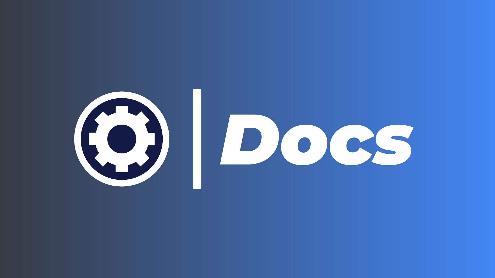
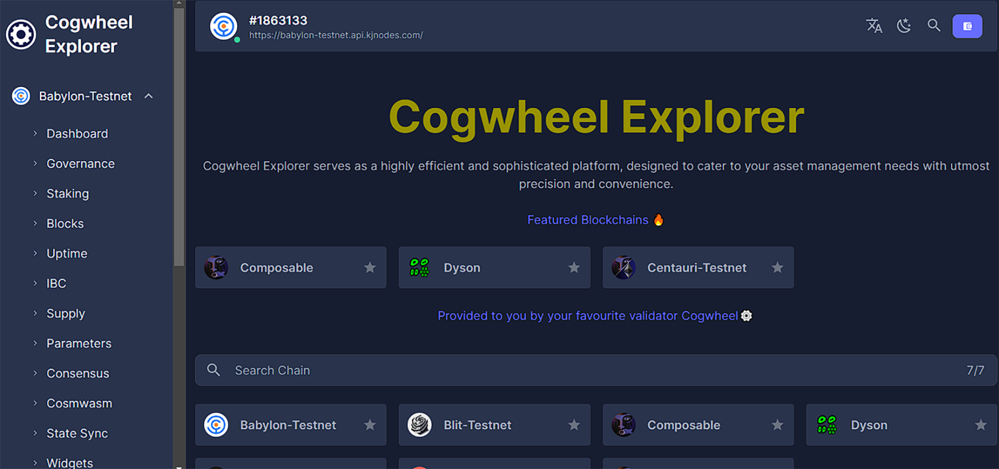

# Welcome to Cogwheel's Docs Page!

## What You'll Find Here

Explore technical data related to the blockchains we are a part of and specific projects we are
involved in. This includes instructions on using our services, information about our services
and setting up nodes.

## Services We Offer

import { Cards,Card } from 'nextra/components'

<Cards>
  <Card
    image
    arrow
    title="Explorer"
    href="/about_services/explorer"
  >
    
  </Card>
  <Card image arrow title="Dyson Frontend" href="/about_services/frontend">
    
  </Card>
  <Card image arrow title="REstake" href="/about_services/restake">
    
  </Card>
  <Card image arrow title="REstake UI" href="/about_services/restake-ui">
    
  </Card>
  <Card image arrow title="Status Board" href="/about_services/status">
    
  </Card>    
  <Card image arrow title="Blockchain Endpoints" href="/about_services/endpoints">
    
  </Card>  
</Cards>

