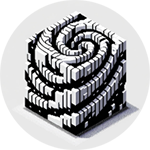

import { Card, Cards } from 'nextra/components'
import { ChevronRightIcon } from '@components/icons'

# Blit Chain

| :------------      | :----------      |
| Chain ID           | blit-1      |
| Chain version      | v0.7  |
| Network type       | mainnet   |

## Endpoints

| :------------      | :----------:                        |
| Blit Chain         | Links                               |
| REST API           | https://blit-api.cogwheel.zone      |
| RPC                | https://blit-rpc.cogwheel.zone      |
| GRPC               | grpc://blit-grpc.cogwheel.zone:443  |

<Cards>
  <Card
    icon={<ChevronRightIcon />}
    title="Install Node"
    href="./blit-chain/install-node"
  />
  <Card
    icon={<ChevronRightIcon />}
    title="Validator Setup"
    href="./blit-chain/validator-setup"
  />
  <Card
    icon={<ChevronRightIcon />}
    title="Node Commands"
    href="./blit-chain/node-commands"
  />
</Cards>